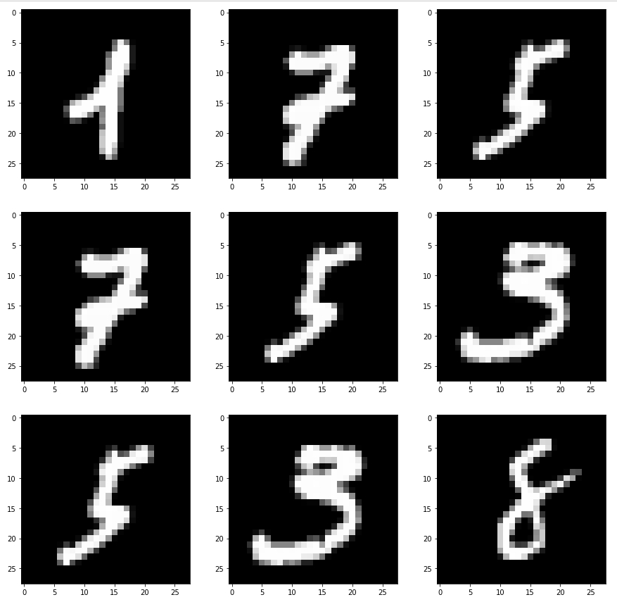

# Developing-a-Handwritten-Digits-Classifier-with-PyTorch

## Project Overview

- As a machine learning engineer, you've embarked on an exciting journey into the realm of deep learning, a formidable tool with applications in diverse fields, especially in the domain of computer vision. This project arises from a compelling need to prototype an Optical Character Recognition (OCR) system for handwritten characters. While the team is actively collecting data samples, your mission is to present a proof of concept, leveraging the renowned MNIST database of handwritten digits, which shares distinct similarities with the project's ultimate input and output.

## Project Tasks

### Step 1: Data Preparation

- Begin by loading the dataset using torchvision.datasets.
- Harness the power of PyTorch's transforms and other methods to transform the data into tensors, normalize it, and flatten it.
- Construct a DataLoader tailored to your dataset to facilitate efficient training.

### Step 2: Data Visualization

- Employ the provided function to visualize the dataset. You can choose to use your training data loader and revert any normalization and flattening steps.
- Alternatively, create a second DataLoader without any additional preprocessing.
- Delve into the size and shape of the data to gain a clear understanding of your inputs both in their natural state and post-transformation. Provide a concise rationale for any preprocessing steps employed or justify why no preprocessing is necessary.

### Step 3: Model Building

- Leverage the capabilities of PyTorch to construct a neural network capable of classifying input images.
- Set up an optimizer to update the weights of your neural network.
- Utilize the training DataLoader to train your neural network effectively.

### Step 4: Model Evaluation

- Assess the accuracy of your neural network on the test set.
- Engage in hyperparameter tuning and adapt your network architecture to enhance test set accuracy, with the target of achieving a minimum accuracy of 90%.

### Step 5: Model Persistence

- Utilize torch.save to persist your well-trained model for future use.

## Environment and Dependencies

- Ensure you have the following prerequisites installed:
  - Python
  - PyTorch
  - torchvision
  - Your preferred deep learning environment

## How to Run

- Start by cloning this repository.
- Execute the code in your preferred deep learning environment, following the steps and instructions provided in the project tasks section.

## Contributors

- [Mohd Zubair](https://github.com/mohdzubairshafi)
